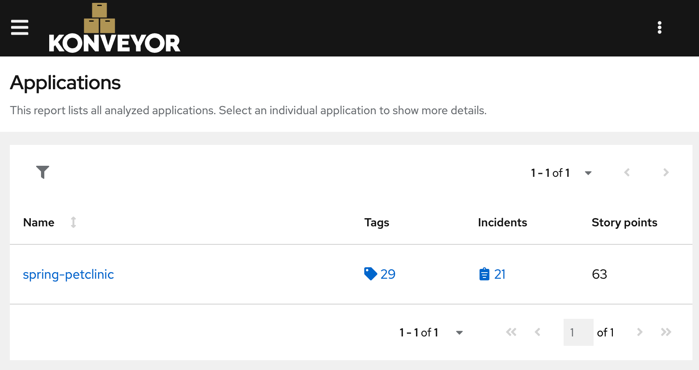
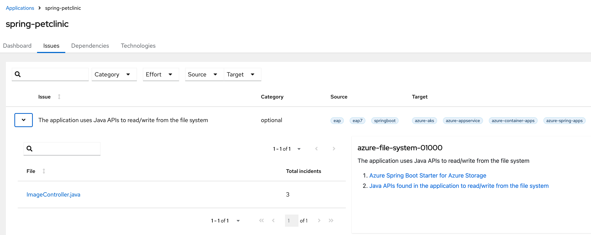

= Cloud Migration Workshop
:icons: font
:toc: left
:toclevels: 3
ifdef::env-github[]
:tip-caption: :bulb:
:note-caption: :information_source:
:important-caption: :heavy_exclamation_mark:
:caution-caption: :fire:
:warning-caption: :warning:
endif::[]

[.lead]
Migrate applications to the cloud
****
This workshop is about migrating applications to the cloud.
It is based on the Konveyor framework, in particular on its Kantra tool, which

* analyzes (Java) applications for cloud readiness, and
* supports the migration of (Java) applications to the cloud.

We concentrate on Java
and use a simple example application to demonstrate the migration process.
The principles and tools can be applied to other languages and applications as well (with some limitations).

[NOTE]
====
Konveyor is a community-driven project that aims to help organizations modernize their applications and infrastructure.
It is part of the Cloud Native Computing Foundation (CNCF).

The workshop is based on the Kantra tool, which is part of the Konveyor project.
Konveyor is usually installed via the OperatorHub in OpenShift or Kubernetes,
while Kantra can run in any container environment.
====
****

== Preparations

[IMPORTANT]
.Use a Linux shell
====
If you are running on Windows, please use either of the following:

* A `bash` (usually part of the Git installation),
* The Windows Subsystem for Linux (WSL), or
* A Linux VM.
====

* Install either
** https://podman.io/[Podman] (recommended by
Konveyor), or
** https://rancherdesktop.io/[Rancher], or
** https://www.docker.com/[Docker] (*recommended*, as we used in the workshop examples).

+
[IMPORTANT]
.Docker environment settings or Podman usage
====
* In case you use _Docker_, you need to set the following environment variable:
+
[source, bash]
export PODMAN_BIN=docker

* In case you use Podman, you need to use `podman` instead of `docker` in the examples.
We will support this by using an environment variable `DOCKER_BIN` in the examples.
+
[source, bash]
export DOCKER_BIN=podman

We recommend using https://direnv.net/[direnv] to set this variable(s) automatically.
====

* Clone this repository and change your shell directory to it.
+
[source, bash]
----
git clone https://github.com/konveyor-demos/spring-petclinic.git
cd spring-petclinic # <1>
----
<1> Perform all subsequent commands in this directory.

+
[TIP]
====
You may use link:WORKSHOP.adoc[this file] (`WORKSHOP.adoc`) for your convenience to copy/paste] commands.
It works best with an `asciidoctor` plugin for your IDE, e.g., the https://intellij-asciidoc-plugin.ahus1.de/docs/users-guide/index.html[IntelliJ Plugin].
====

* Switch to the workshop branch.
+
[source, bash]
git checkout workshop

* Build the Spring PetClinic application for container usage
+
[source, bash]
----
${DOCKER_BIN:-docker} compose build
----

* Install Java 11 or higher (optional, but recommended), e.g., with https://sdkman.io/[SDKMAN!].
* Install Kantra by following the https://github.com/konveyor/kantra?tab=readme-ov-file#downloading-stable-release[installation instructions].
+
[TIP]
====
In case you want to use the latest version, you can execute the link:scripts/get-kantra.sh[get-kantra.sh] script to download and install Kantra for your convenience.

[source, bash]
----
./scripts/get-kantra.sh
----
====

== Exercises

=== Exercise 1: Run a (scaled) Spring PetClinic application

==== Start with initial application

. Start the Spring PetClinic application in a container.
+
[source, bash]
----
${DOCKER_BIN:-docker} compose up -d
----

. Upload some images (cf. link:scripts/upload-dummy-image.sh[upload-dummy-image.sh]).
+
[source, bash]
----
./scripts/upload-dummy-image.sh
# -> Image uploaded successfully
----

. List the uploaded images (cf. link:scripts/list-images.sh[list-images.sh]).
+
[source, bash]
----
./scripts/list-images.sh
# -> Image list: ...
----

==== Scale up

. Now, scale the application to more (>= 2) replicas.
+
[source, bash]
----
${DOCKER_BIN:-docker} compose up -d --scale petclinic=2
${DOCKER_BIN:-docker} compose restart nginx # necessary to update the load balancer
----

. List the uploaded images again.
You should see that the images are distributed across the replicas.
Either

** You get the list as before:
+
[source, bash]
----
./scripts/list-images.sh
# -> Image list: ...
----
** Or, you get an empty list:
+
[source, bash]
----
./scripts/list-images.sh
# -> []
----

. If you add more images, you will even see that they are distributed across the replicas.

==== Solution 1a: Running Kantra (Minimal) for Analysis

* Run Kantra with the following command.
+
[source, bash]
.Run Kantra (Cloud Readiness)
----
ifndef::env-github[]
kantra \# <1>
  analyze \# <2>
  --overwrite \# <3>
  -i . \# <4>
  -o ../out \# <5>
  --mode source-only \# <6>
  --target cloud-readiness # <7>
endif::env-github[]
ifdef::env-github[]
kantra \
  analyze \
  --overwrite \
  -i . \
  -o ../out \
  --mode source-only \
  --target cloud-readiness
endif::env-github[]
----
<1> Is `kantra` in `+${PATH}+`? Otherwise, for example, `../kantra`
<2> Kantra sub-command `analyze` (see `kantra help`)
<3> Overwrite existing results
<4> Input: Current directory
<5> Output: Directory outside the current directory
<6> Analyze only your own source code, no dependencies
<7> Minimal target: Cloud migration (generic)

* Open the resulting report in your browser.
+
[source, bash]
.Open the report
----
open ../out/static-report/index.html
----

* Check the report for the Spring PetClinic application.
+

==== Solution 1b: Improved Kantra Analysis

There are better targets for the analysis (with better reporting).

* List the available targets.
+
[source, bash]
----
kantra analyze --list-targets
----

* Choose `azure-aks` as the target.
+
[source, bash]
----
ifndef::env-github[]
kantra \# <1>
  analyze \
  --overwrite \
  -i . \
  -o ../out \
  --mode source-only \
  --target azure-aks # <2>
endif::env-github[]
ifdef::env-github[]
kantra \
  analyze \
  --overwrite \
  -i . \
  -o ../out \
  --mode source-only \
  --target azure-aks
endif::env-github[]
----
<1> Mind the `+${PATH}+`!
<2> The target `azure-aks` is a more specific target which provides better reporting.

* Check the extended report in your browser.
+

=== Exercise 2: Migrate to current Spring Boot (3.x)

Run the PetClinic (once again) to see if it builds and view the version.

[source, bash]
----
mvn spring-boot:run
----

Look at the Log Output of the Spring Boot application.
You should see its running Spring 2.6.6.

[source, console]
----
...
:: Built with Spring Boot :: 2.6.6
...
----

==== Extend the POM by OpenRewrite (optional)

* Extend the `pom.xml` by the OpenRewrite Maven plugin.
+
[source, xml]
.OpenRewrite Maven Plugin -> `pom.xml`
----
<plugin>
  <groupId>org.openrewrite.maven</groupId>
  <artifactId>rewrite-maven-plugin</artifactId>
  <version>5.27.0</version>
  <configuration>
    <activeRecipes>
      <recipe>org.openrewrite.java.spring.boot3.UpgradeSpringBoot_3_2</recipe>
    </activeRecipes>
    <activeStyles>
      
    </activeStyles>
  </configuration>
  <dependencies>
    <dependency>
      <groupId>org.openrewrite.recipe</groupId>
      <artifactId>rewrite-spring</artifactId>
      <version>5.7.0</version>
    </dependency>
  </dependencies>
</plugin>
----

[NOTE]
====
The SpringFormat style is defined under `activeStyles`,
so that OpenRewrite automatically formats in the way Spring expects it.
This should prevent any formatting issues after the transformation,
but does not format everything in a way that fulfills the validation of the Spring Format tool.
====

* Then run the OpenRewrite Maven plugin.
+
[source, bash]
----
./mvnw rewrite:run
----

==== Run OpenRewrite full CLI (alternative)

Alternatively you may run OpenRewrite completely from the command line.

[source, bash]
----
./mvnw org.openrewrite.maven:rewrite-maven-plugin:run \
  -Drewrite.activeRecipes=org.openrewrite.java.spring.boot3.UpgradeSpringBoot_3_2
----
